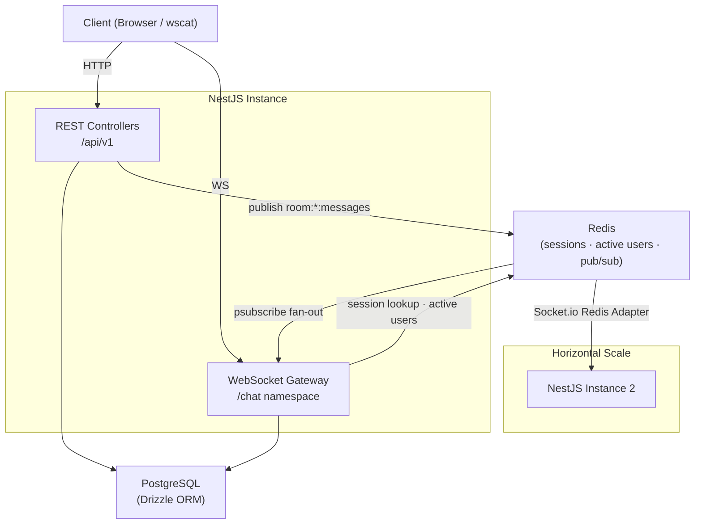

# Architecture

## Overview

### Request flow summary

1. **REST** — client hits a controller, controller calls a service, service reads/writes PostgreSQL via Drizzle. For `POST /messages` the service also publishes an event to Redis instead of emitting WebSocket directly.
2. **WebSocket** — on connection the gateway validates the session token against Redis, joins the Socket.io room, and tracks the socket in Redis. A `psubscribe` listener translates Redis-published events into Socket.io emits.
3. **Fan-out** — the Socket.io Redis adapter synchronises `server.to(roomId).emit(...)` calls across all NestJS instances, so a message published on instance A reaches clients connected to instance B.

---

## Session Strategy

Authentication uses an opaque 32-byte hex token generated with `crypto.randomBytes(32).toString('hex')`.

- Stored in Redis as `session:<token>` → JSON `{ userId, username }` with a 24-hour TTL.
- On every authenticated HTTP request, `SessionGuard` reads `Authorization: Bearer <token>`, performs a single Redis `GET`, and attaches `{ userId, username }` to the request object.
- On WebSocket connect, the same lookup happens using the `token` query parameter.
- No JWT — avoids revocation complexity. Because the token is opaque and short-lived in Redis, invalidation is a single `DEL` call with no need to track a revocation list.

---

## Redis Pub/Sub Fan-out

When `POST /rooms/:id/messages` is called:

1. The message is persisted to PostgreSQL.
2. `RedisService.publish('room:<roomId>:messages', payload)` publishes to a Redis channel.
3. Every NestJS instance has a dedicated ioredis subscriber client that calls `psubscribe('room:*:messages', 'room:*:deleted')`.
4. On `pmessage`, the gateway calls `this.server.to(roomId).emit('message:new', ...)`.
5. The Socket.io Redis adapter propagates that emit to all instances, reaching every connected client in the room regardless of which instance they are connected to.

The same pattern applies to room deletion: `DELETE /rooms/:id` publishes to `room:<roomId>:deleted`, which causes the gateway to emit `room:deleted` to all clients in the room.

---

## Concurrent User Capacity (single instance estimate)

| Factor | Estimate |
|--------|----------|
| WS connection overhead | ~50 KB per socket (Socket.io framing + Node.js handle) |
| Node.js heap (512 MB container) | ~400 MB usable after NestJS baseline |
| WS connections at 50 KB each | ~8,000 theoretical max |
| Event-loop throughput bottleneck | Practical ceiling ~2,000–5,000 concurrent connections |
| Redis RTT | ~1 ms (same datacenter) |

**Practical estimate: 2,000–5,000 concurrent WebSocket connections per 512 MB instance** before the event loop becomes the bottleneck, not memory.

---

## 10× Scaling Plan

| Layer | Strategy |
|-------|----------|
| **NestJS** | Horizontal instances behind a load balancer. Stateless authentication (Redis sessions) means any instance can serve any request. WebSocket sticky sessions are optional because the Redis adapter synchronises emits across instances. |
| **PostgreSQL** | Add read replicas for `GET /rooms` and `GET /messages` queries. Write traffic (`POST /messages`, login, room creation) stays on the primary. |
| **Redis** | Migrate to Redis Cluster for pub/sub throughput. Shard keys by `roomId` to distribute load. |
| **Load balancer** | Terminate TLS, forward WebSocket upgrades (`Connection: Upgrade`). Nginx or a cloud-native LB (ALB, Cloudflare) both work. |

---

## Known Limitations

- **No message delivery guarantee** — pub/sub is fire-and-forget. If a subscriber is offline when a message is published, it is missed. Persistent delivery would require a message queue (e.g., BullMQ) with at-least-once semantics.
- **Redis single point of failure** — a Redis outage takes down sessions, active-user tracking, and pub/sub simultaneously. Mitigation: Redis Sentinel or Redis Cluster.
- **Username-only identity** — usernames are unique in the DB but there is no password, email, or account recovery. Anyone who knows a username can claim it by logging in, generating a new session token.
- **No rate limiting** — the API accepts unlimited requests per IP. A burst of `POST /messages` calls will happily flood the database and pub/sub channels.
- **No message edit or delete** — messages are immutable once written.
